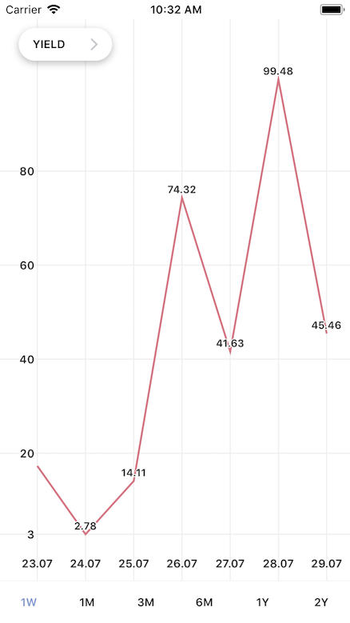
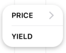
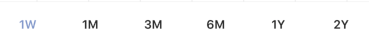

# LineChartViewController

<p align="center" >

</p>

Класс реализует контроллер с графиком, выпадающим списком показателей, горизонтальным списком кнопок с периодами. Вид экземпляра класса необходимо добавить на родительский, задать виду фрейм. Для загрузки данных необходимо присвоить значение isin: . Внешний вид графика можно настроить в setter lineChart по протоколу LineChartViewPresentable. Поддерживает landscape.

* Swift

```swift

let lineChart = LineChartViewController()
self.view.addSubview(lineChart.view)

lineChart.isin = "12345"
```

### LineChartViewController состоит из трех UI элементов. 
- LineChart – график
- DropListViewController – выпадающий список
- ButtonsViewController – горизонтальный список кнопок

Каждый элемент можно переиспользовать отдельно от остальных.


## LineChart

Класс UIView рисует линейный график/графики.

## DropListViewController

<p align="center" >

</p>

Класс реализует выпадающий список. Список реализован через UITableView. Принимает заголовки строк таблицы в методе setDataSource: . Сообщает о выбранной строке в selectedRow:

## ButtonsViewController

<p align="center" >

</p>

Класс реализует горизонтальный список кнопок. Список реализован через UIStackView с UIButton. Принимает заголовки кнопок через dataSource: .  Сообщает о выбранном индексе в selectedIndex: .
